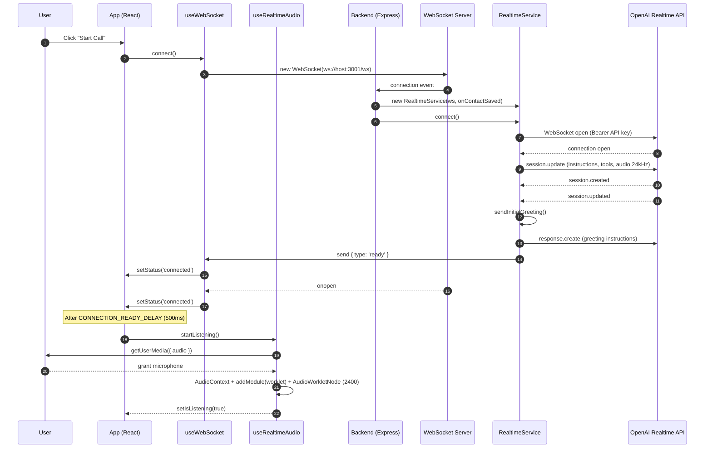
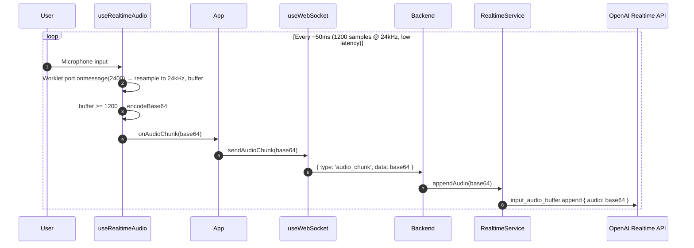
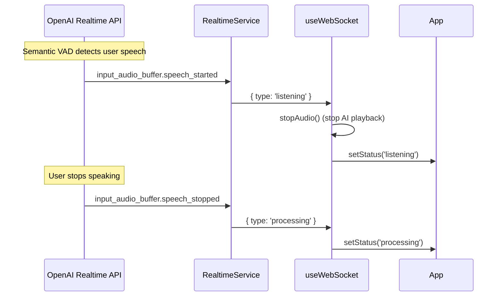
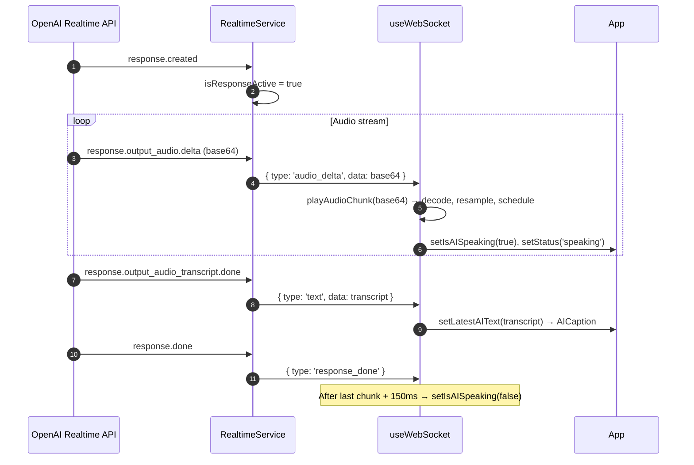
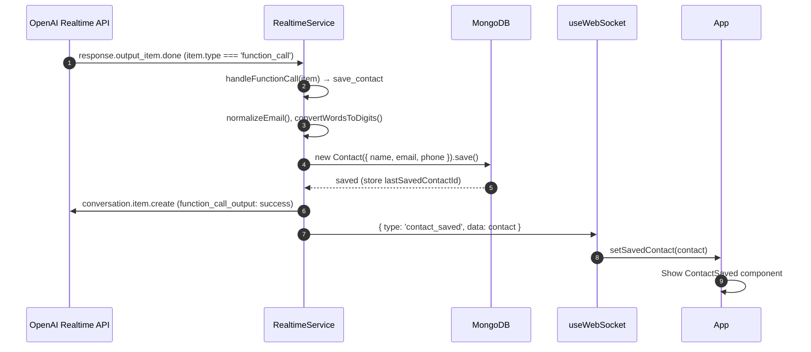
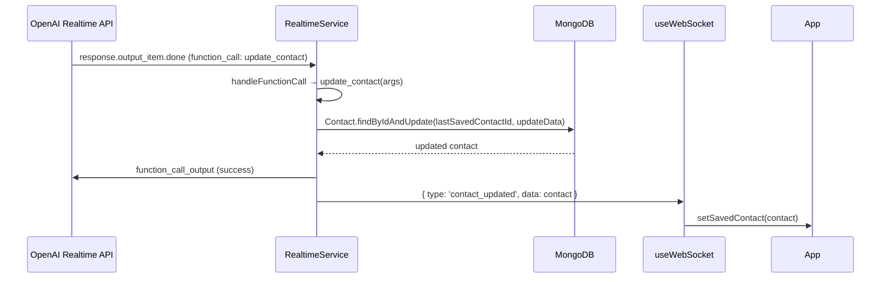
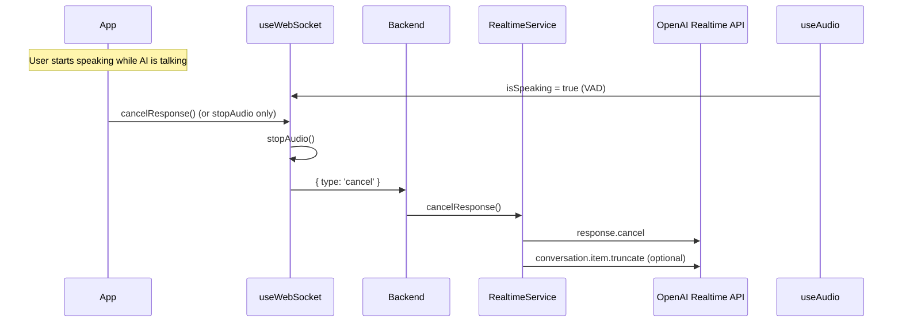
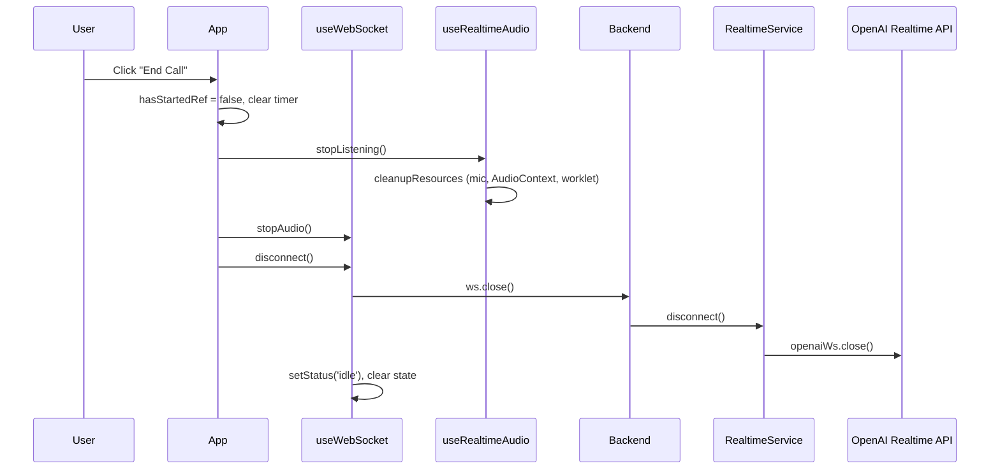

# Voice AI Contact Collector — Sequence Diagram

This document describes the end-to-end flow using Mermaid sequence diagrams. You can render them in GitHub, VS Code (Mermaid extension), or [mermaid.live](https://mermaid.live).

---

## 1. Call setup (user clicks "Start Call")

---

## 2. User speaks → audio to backend → OpenAI

---

## 3. OpenAI detects speech and sends "listening" / "processing"

---

## 4. AI responds with audio and text

---

## 5. AI calls save_contact → database → notify frontend

---

## 6. Optional: AI calls update_contact (user corrects info)

---

## 7. User interrupts AI (optional)

---

## 8. End call

---

## Component summary

| Layer | Components | Role |
|-------|------------|------|
| **Frontend** | `App`, `CallButton`, `AICaption`, `ContactSaved` | UI and orchestration |
| **Frontend** | `useWebSocket` | WS to backend, send audio chunks, receive events, play AI audio |
| **Frontend** | `useRealtimeAudio` | Mic capture via AudioWorklet (2400→24kHz, buffer ~50ms), emit base64 chunks (low latency) |
| **Frontend** | `public/audio-processor.worklet.js` | AudioWorklet processor: buffers 2400 samples (~50ms at device rate), posts to main thread |
| **Backend** | Express + `createServer`, `WebSocketServer` on `/ws` | HTTP + WS server |
| **Backend** | `handleWebSocketConnection` | Per-client handler, creates RealtimeService, routes messages |
| **Backend** | `RealtimeService` | Bridge: client WS ↔ OpenAI Realtime API, tools → DB |
| **External** | OpenAI Realtime API | Voice model (gpt-realtime), Whisper transcription, tools |
| **External** | MongoDB | Contact persistence |
